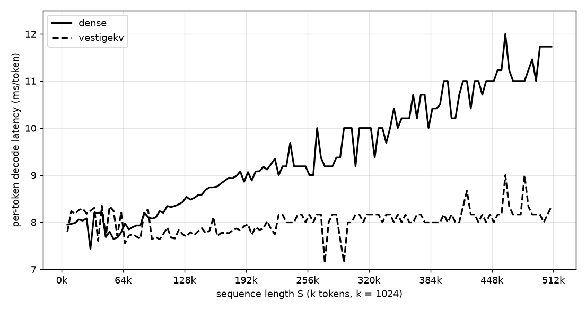
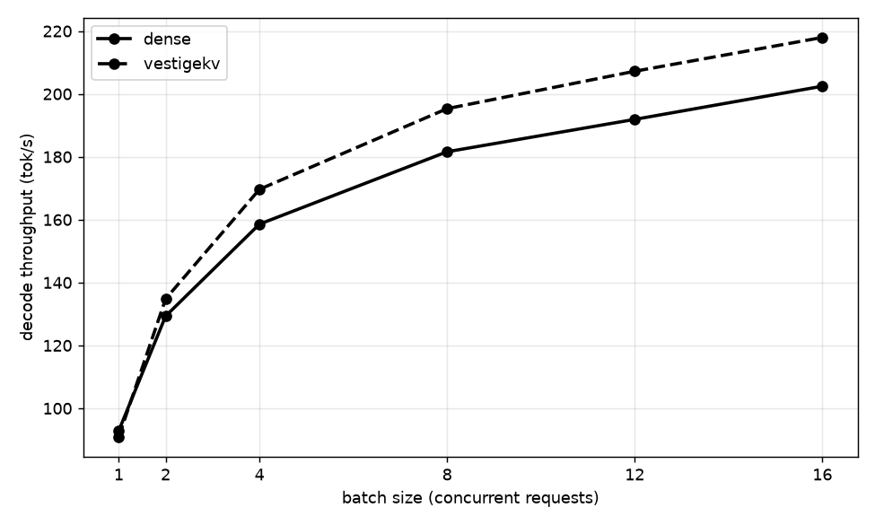

# VestigeKV — experiments

> **Initialize the submodule before anything else:**
> ```bash
> git clone --recurse-submodules <this-repo>
> # in an already-cloned checkout:
> git submodule update --init --depth 1
> ```
> The only code dependency is `engine/` (an sglang fork, branch
> `vestigekv`, one commit, shallow-cloned). Without it, everything under
> `mexp/` raises `ImportError`.

## What it does

**VestigeKV** is a training-free KV-cache compression backend for NoPE-MLA
models (Kimi Linear family), shipped as the sglang attention backend
`vestigekv_mla`. It evicts by a query-independent signal the cache already
carries — the 64-dim un-roped sidecar branch, a vestige of RoPE that NoPE
training repurposes into a salience channel — keeping a global top-(S/32) of
rows attended while a **certified per-step recall tier** (rank-64 sketch +
conformal certificate) keeps every archived row reachable: no row is ever
dropped. The whole recall step runs as **seven fused Triton kernels inside
the decode CUDA graph** — one launch per step, no extra fixed cost, and the
graph never recaptures for VestigeKV reasons. Cache rows stay bit-exact
bf16; no quantization anywhere.

## Results at a glance

> Throughout this repo and the paper, **k = 1024 tokens** (KiB-style, not
> 1000): 4k prefill = 4096 tokens, 64k = 65536, 512k = 524288.

| figure | what it shows |
|---|---|
|  | bs=1 streaming decode: one request prefilled at 4k and decoded continuously to 512k; per-token latency vs. sequence length, vestigekv vs. dense (same tree, triton backend). Crossover ~48k; 1.20x at 272k, 1.39x at 496k. |
|  | Throughput: 64k prefill + 4k decode, batch 1..16 (memory-capped on this card); attention cannot batch while shared weights amortize, so the vestigekv advantage grows with batch (+8% at bs=12). |

*(Both figures are produced by `mexp/bench/plot_curve_jsonl.py` and
`plot_batch_throughput.py` from the frozen raw data in `results/`; the exact
collection commands are in the experiment steps below.)*

## The vestigekv startup transient, and why bs=1 sits near dense

Every request pays a small **startup transient**: tier-2 fits its conformal
certificate on the first 8--64 live decode queries, rebuilding the index as
that window grows. Engineering has reduced it (all bit-exact; see
[docs/INFRA_OPTIMIZATIONS.md](docs/INFRA_OPTIMIZATIONS.md)):

- calibrated rebuilds now **reuse the scan operands** across the window
  (they are independent of the calibration queries), collapsing the 5--9
  per-request archive passes to one;
- the build path's `kept_len` device readbacks are removed by a host-side
  mirror (they had stalled step 0 on the prefill tail);
- the in-graph kernels are clipped **per batch-size class** to the live
  pair count, so capacity placeholders are not launched.

What remains is the synchronous provisional index at the first decode step
(tier-2 must serve from step 1). The transient is per-request-bounded and
independent of context length: the first bucket of the latency curve runs
~0.2 ms/step above steady state (gone by ~112k).

**Why bs=1 throughput sits ~2--3% below dense at 64k+4k is NOT this
transient.** A 4k-token decode request runs ~33 s; the transient is tens of
ms, under 0.3% of it. The real reason is the **steady-state attention
share**: at 64k, attention is only ~7% of the decode step (MoE + linear
layers + the two-node pipeline dominate), so compressing it 32x saves at
most a fraction of a percent of the step, which the recall scan roughly
offsets -- vestigekv and dense are within launch-noise at bs=1. The
advantage appears where attention's share grows: with batch (the throughput
curve, +8% by bs=12, since attention cannot batch) and with context length
(the latency curve, 1.20x at 272k and 1.39x at 496k).

## Experiment steps

Reproducibility repository for **VestigeKV: The NoPE-MLA KV Cache Carries Its
Own Eviction Signal in a Vestigial Branch**. This is the *experiment project*:
pre-registrations, the paper, results (`out/*.json`), and the minimal
experiment-side tooling. The system under test lives in the **sglang
submodule** (`sglang`, attention backend `vestigekv_mla`); the
official sglang benchmark is the authoritative measurement path.

Every experiment here is **pre-registered**: its decision rule is frozen (dated,
in a `PREREGxx.md`) before its data exists. Verdicts are appended after. Each
experiment also has a step-by-step **skill file** under `skills/` (indexed
below) — invoke or read the skill to reproduce that one experiment.

## Code layout

| | |
|---|---|
| `engine` | **the only code dependency** (submodule): serving engine + VestigeKV backend |
| `mexp/` | active experiment scripts: data collection + what sglang lacks (see `mexp/README.md`) |
| `tools/` | health check, config check, serving launch harness |
| `archive/` | frozen scripts of published gates (mini-sglang era; not runnable — its dependency is retired) |

`mexp/_bootstrap.py` puts the submodule's `python/` on `sys.path`; a sibling
checkout at `/home/user/fft/sglang` takes over when present.

## Setup

```bash
# 0. Submodule (REQUIRED — see the box at the top)
git submodule update --init --depth 1

# 1. Python env (conda): torch (cu128), transformers, datasets, safetensors, fla
conda activate sglang        # or your env with the above

# 2. Kimi Linear checkpoint in the HF cache (moonshotai/Kimi-Linear-48B-A3B-Base)
#    downloaded once; the scripts read it from ~/.cache/huggingface

# 3. (serving experiments only) a GPU; dual-machine experiments need the second
#    box reachable — see mexp/README.md.

# 4. Weights daemon (step 0 of every serving experiment): warms the checkpoint
#    into RAM, holds it there, and prints the content-level WEIGHT-FP once.
#    Every launch script prints the same WEIGHT-FP line, so any run's log can
#    be checked against the daemon's declaration — both arms provably load
#    the same bytes. Keep it running for the whole session:
python tools/weight_daemon.py &
# expected: WEIGHT-FP 6503cda5dbec0bfc14f65b9e2f17c335c31a89ecc1141ce3a2f481fea6f97f56
```

## Baseline arm (IMPORTANT)

The dense baseline uses THE SAME checkout as the experiment arm — just select
the stock backend: `--attention-backend triton`. Do NOT check out upstream
sglang for the baseline: the VestigeKV diff outside its own package is four
inert stock-file edits, and running both arms from one tree is precisely the
demonstration that they do not perturb stock behavior. Both arms' launch logs
print the same WEIGHT-FP line (see step 0), attesting identical weights.

## How to run an experiment

Each experiment is a skill under `skills/`. Read `skills/<name>.md` for its
PREREG, exact command, and verdict, then run the command it lists. The
directory-queue runner is retired to `archive/` along with the pre-port probe
scripts and the mini-sglang-era gate scripts (frozen, not runnable).

## Experiment index

> Filled from the experiment catalogue. Each row links its skill file; the
> skill carries the exact reproduce command, the frozen bar, and the
> verdict. The dated pre-registration files themselves (frozen before their
> data, never edited after) ship with the paper's supplementary materials,
> not this repository; the prereg column names the file each skill answers
> to.

<!-- INDEX moved to EXPERIMENTS.md -->

The full catalogue -- ~40 pre-registered experiments across three phases
(core compressor, deployment-port validation, dual-machine serving), each
with its frozen bar and verdict -- lives in **[EXPERIMENTS.md](EXPERIMENTS.md)**.

## Reproduce the headline results by hand

All commands below run from the repository root after Setup (submodule,
env, checkpoint, weights daemon). `$NODE1` is the second machine; single
runs use two terminals or `ssh`.

```bash
# --- launch the vestigekv arm (both nodes; node1 first) -----------------
# node1:  SGLANG_PP_LAYER_PARTITION=23,4 python -m sglang.launch_server \
#           --model-path <kimi-linear-48b> --trust-remote-code \
#           --attention-backend vestigekv_mla --tp-size 1 --pp-size 2 \
#           --nnodes 2 --node-rank 1 --dist-init-addr <node0-ip>:29500 \
#           --context-length 524288 --max-total-tokens 589824 \
#           --cuda-graph-max-bs 2 --sampling-backend pytorch \
#           --disable-radix-cache
# node0: same, --node-rank 0. The dense baseline is the SAME command with
#        --attention-backend triton (same tree; see "Baseline arm").

# --- metric 1: bs=1 latency curve (4k prefill -> 512k continuous decode) --
python -m sglang.benchmark.serving --backend sglang \
  --model <kimi-linear-48b> --num-prompts 1 --dataset-name random \
  --random-input-len 4096 --random-output-len 520192 --random-range-ratio 1 \
  --max-concurrency 1 --warmup-requests 0 --output-details \
  --output-file results/latency_stream_4k-512k_<arm>.jsonl
# keep the node-0 server log: it is the per-token authority above ~240k

# --- metric 2: throughput (64k prefill + 4k decode, batch sweep) ----------
# relaunch with --context-length 73728 --max-total-tokens 1130496 \
#   --cuda-graph-max-bs 16
for BS in 1 2 4 8 12 16; do
  python -m sglang.benchmark.serving --backend sglang \
    --model <kimi-linear-48b> --num-prompts $((BS*2)) --dataset-name random \
    --random-input-len 65536 --random-output-len 4096 --random-range-ratio 1 \
    --max-concurrency $BS --warmup-requests 0 --output-details \
    --output-file results/throughput_64k+4k_bs${BS}_<arm>.jsonl
done

# --- quality: gsm8k long-shot + MAUVE (per arm) ---------------------------
# relaunch with --context-length 16384 --cuda-graph-max-bs 4, then:
bash mexp/quality/run_quality.sh vestigekv
bash mexp/quality/run_quality.sh dense
bash mexp/quality/run_quality.sh score     # after both arms; needs the GPU

# --- figures --------------------------------------------------------------
python mexp/bench/plot_curve_jsonl.py \
  --arm dense:results/latency_stream_4k-512k_dense.jsonl \
  --arm vestigekv:results/latency_stream_4k-512k_vestigekv.jsonl \
  --srv dense:results/latency_stream_serverlog_dense.log \
  --srv vestigekv:results/latency_stream_serverlog_vestigekv.log \
  --clip 229376 --ylim 7:12.5 --out results/fig_latency_curve.png
python mexp/bench/plot_batch_throughput.py \
  --arm dense:results/throughput_64k+4k_bs1_dense.jsonl,... \
  --arm vestigekv:results/throughput_64k+4k_bs1_vestigekv.jsonl,... \
  --out results/fig_throughput.png
```

### Algorithm claims (single machine, HF-forward harness)

The needle-retrieval, observed-attention baselines (H2O / SnapKV /
StreamingLLM), the RoPE-collapse control, the sketch-rank and branch-width
ablations, and teacher-forced bits-per-byte are measured by the HF-forward
harness (`harness/`, no two-node serving). Each paper table names its
`--ops` and its PREREG in the matching skill file (see `EXPERIMENTS.md`).

```bash
# needle + observed-attention baselines at 8k (Table: baselines / tab:main)
python harness/e2e.py --arch kimi --seq-len 8192 --n-docs 0 \
  --needle-trials 24 --gpu-expert-layers 18 --seed 0 --ops baselines \
  --out results/harness_baselines_8192.json
# RoPE-collapse negative control (Table: rope) -- same op set on a RoPE-MLA
python harness/e2e.py --arch dsv2 --seq-len 8192 --n-docs 0 \
  --needle-trials 24 --gpu-expert-layers 18 --seed 0 --ops twotier \
  --out results/harness_rope_8192.json
# sketch-rank sweep (Table: ablation) and bits-per-byte (Table: bpb) select
# their own --ops/--rhos; see the PREREG in each skill file for the exact line.

# post-training survival (Appendix: SFT): the SAME command on the Instruct
# checkpoint, with the Base weights run as an in-session control. Both arms
# use byte-identical modelling code (the Base copy) so the only variable is
# the weights; register the paths as `kimi_instruct` / `kimi_base_mirror`
# in harness/extract.py.
for ARCH in kimi_base_mirror kimi_instruct; do
  python harness/e2e.py --arch $ARCH --seq-len 8192 --n-docs 0 \
    --needle-trials 24 --gpu-expert-layers 18 --seed 0 \
    --ops twotier,imp_only,recent --rhos 32,128 \
    --out results/harness_needle_8192_${ARCH#kimi_}.json
done
# static anatomy (branch/content row norms), weights only, no forward pass:
python harness/dissect.py <model-dir> results/harness_anatomy_<arm>.json
```
